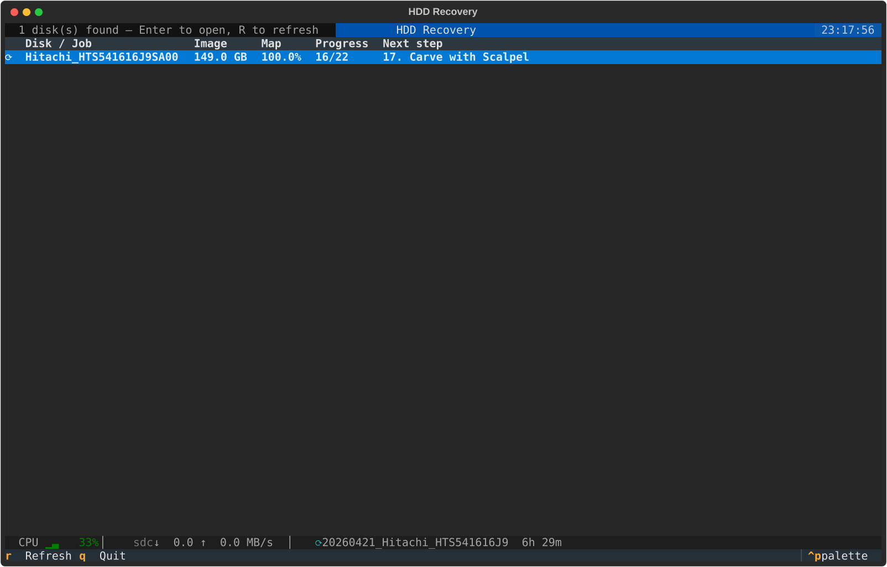
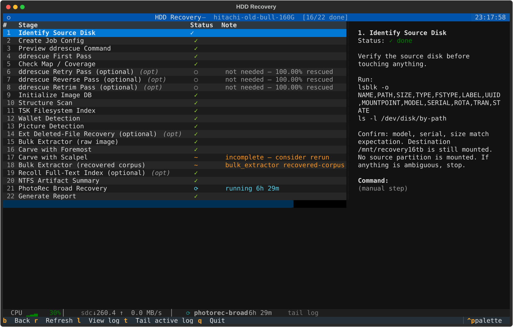
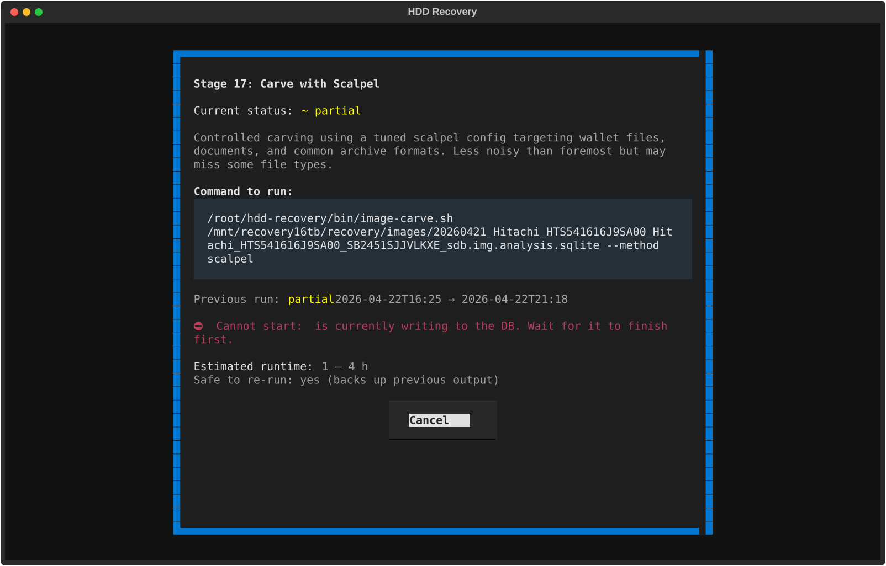

# hdd-recovery

A guided disk-recovery workspace for imaging old and failing HDDs and extracting
files, pictures, and wallet artifacts from the resulting images.

Everything runs on a local Kali Linux machine with a 16 TB destination disk.
All analysis is done on image files — the original source disk is never written to
or mounted read-write.

---

## Screenshots

### Dashboard — all disks at a glance



### Disk detail — 22-stage guided checklist



### Confirm dialog — shows the exact command before running



---

## Hardware layout

| Role | Device | Notes |
|---|---|---|
| OS | `/dev/sda` | Samsung SSD, do not touch |
| Destination | `/dev/sdc` → `/mnt/recovery16tb` | 16 TB Toshiba, ext4, label `RECOVERY16TB` |
| Source | next available SATA port | identified by model/serial/by-path before each run |

`/dev/sdb` is a ZFS member — never format, mount, or alter it.

---

## Safety rules

- Never write to a source disk
- Never mount a source disk read-write
- Never mount a source disk before imaging without a specific reason
- If disk identity is ambiguous — stop and verify
- Never run SMART self-tests during imaging
- Never delete, compact, or deduplicate recovery outputs before human review
- Never start a second DB-writing stage while one is already running

---

## Quick start

### 1. Image a disk

```bash
# Copy and fill in the job config
cp bin/ddrescue-job-template.conf jobs/<name>.conf
# fill SOURCE_DEV, SOURCE_BY_PATH, SOURCE_MODEL, SOURCE_SERIAL, SOURCE_SIZE_BYTES, BASENAME

# Preview (nothing written)
bin/ddrescue-run.sh jobs/<name>.conf plan
bin/ddrescue-run.sh jobs/<name>.conf first

# Run
bin/ddrescue-run.sh jobs/<name>.conf first --run

# Check coverage
bin/ddrescue-status.sh /mnt/recovery16tb/recovery/logs/<basename>.map

# Retry passes if unread areas remain
bin/ddrescue-run.sh jobs/<name>.conf retry --run
bin/ddrescue-run.sh jobs/<name>.conf reverse --run
```

### 2. Analyse the image

```bash
IMAGE=/mnt/recovery16tb/recovery/images/<basename>.img
DB=${IMAGE}.analysis.sqlite

# Fast metadata-first path (5–20 min)
bin/image-process.sh $IMAGE

# Query results
bin/image-query.sh $DB summary
bin/image-query.sh $DB wallets
bin/image-query.sh $DB pictures

# Heavy stages (hours each — run as needed)
bin/image-bulk-extractor.sh $DB --scope raw
bin/image-ext-recover.sh $DB
bin/image-carve.sh $DB --method foremost
bin/image-carve.sh $DB --method scalpel
bin/image-bulk-extractor.sh $DB --scope recovered
bin/image-ntfs-artifact-summary.sh $DB
bin/image-photorec-run.sh $DB --profile broad
bin/image-report.sh $DB
```

### 3. Use the TUI (recommended)

```bash
bin/tui.sh
```

The TUI discovers all known disks automatically, shows where each one is in the
22-stage workflow, and guides you through each step with an explanation and a
confirmation before anything runs.

---

## TUI

Built with [Textual](https://textual.textualize.io/) and managed with
[uv](https://github.com/astral-sh/uv). Dependencies install automatically on
first run.

### Key bindings

**Dashboard**

| Key | Action |
|---|---|
| `Enter` | Open disk detail |
| `R` | Refresh disk list |
| `Q` | Quit |

**Disk detail**

| Key | Action |
|---|---|
| `Enter` | Show confirm dialog for selected stage |
| `L` | View log of selected stage |
| `T` | Jump to log of whichever stage is currently running |
| `R` | Refresh stage statuses |
| `B` | Back to dashboard |
| `Q` | Quit |

**Confirm dialog**

| Key | Action |
|---|---|
| `Y` | Run the command |
| `N` / `Esc` | Cancel |

### System bar

The bottom bar updates every 2 seconds:

```
CPU ▁▃▅▆  23%  │  sdc ↓204 ↑0.0 MB/s  │  ⟳ photorec-broad  6h 02m  [T] tail log
```

- CPU sparkline + current % (green → yellow → red at 50%/80%)
- Destination disk (`sdc`) read/write MB/s from `/proc/diskstats`
- Running recovery stage name and elapsed time from `scan_runs` DB

---

## Directory layout

```
bin/                     acquisition and analysis scripts
  ddrescue-run.sh        imaging wrapper (preview + all passes)
  ddrescue-status.sh     map coverage summary
  image-process.sh       fast metadata-first analysis pipeline
  image-analysis-init.sh create/refresh per-image SQLite DB
  image-structure-scan.sh fdisk/parted/mmls/blkid scan
  image-index-tsk.sh     filesystem-aware inventory via fiwalk
  image-detect-wallets.sh score files for wallet candidates
  image-detect-pictures.sh score files for picture candidates
  image-ext-recover.sh   ext3/ext4 deleted-file recovery
  image-bulk-extractor.sh bulk_extractor on raw image or corpus
  image-carve.sh         foremost or scalpel carving
  image-photorec-run.sh  unattended PhotoRec (/cmd mode)
  image-ntfs-artifact-summary.sh  Windows traces from bulk_extractor
  image-index-recoll.sh  full-text Recoll index
  image-query.sh         read-only DB queries
  image-export.sh        copy a specific file out
  image-report.sh        generate summary report
  tui.sh                 launch the TUI

lib/
  common.sh              shared bash library (logging, DB helpers, artifact registration)

sql/
  analysis-schema.sql    SQLite schema (idempotent CREATE IF NOT EXISTS)

config/
  analysis-pipeline.env  base paths and feature flags
  keywords/              wallet and interest keyword lists
  scalpel/               tuned scalpel config
  photorec/              PhotoRec option samples

jobs/                    per-disk ddrescue job configs (one per source disk)
manifests/               source disk manifests (YAML)

tui/                     interactive TUI (Python + Textual)
  main.py                app entry point
  config.py              path/env loading
  stages.py              22-stage workflow definitions
  state.py               disk discovery and stage-status derivation
  executor.py            command building and async subprocess launch
  monitor.py             SystemBar widget (CPU/IO/process timer)
  screens/
    dashboard.py         multi-disk overview
    disk_detail.py       per-disk 22-stage checklist
    confirm.py           command preview and Y/N confirmation
    log_viewer.py        live output streaming and log tail

docs/                    screenshots

/mnt/recovery16tb/recovery/
  images/                raw disk images (*.img) and per-image SQLite DBs
  logs/                  ddrescue map files, rate logs, event logs
  exports/<basename>/    per-image analysis outputs
    structure/           fdisk/parted/mmls outputs
    recovered/           carving and recovery outputs by method
    indexes/             bulk_extractor feature files
    logs/                per-stage log files
    reports/             generated reports
  manifests/             source disk manifests
```

---

## Per-image SQLite database

One database per image, stored beside the image as `<image>.analysis.sqlite`.

| Table | Contents |
|---|---|
| `image_info` | image path, SHA256, size, ddrescue map path, export root |
| `scan_runs` | one row per stage execution: status, timestamps, log path, output dir |
| `partitions` / `filesystems` | structure scan results |
| `files` | filesystem-aware inventory from fiwalk (paths, inodes, timestamps, deleted flag) |
| `wallet_candidates` | scored wallet hits from the files inventory |
| `picture_candidates` | scored picture hits from the files inventory |
| `recovered_artifacts` | carved/recovered files with SHA256 and mime type |
| `bulk_extractor_hits` | imported feature-file rows (capped per scope) |
| `exports` / `notes` | exported files and operator notes |

---

## Monitoring

```bash
# Passive tmux monitor (background windows for logs, SMART, mount status)
/root/start-recovery-monitor.sh
tmux attach -t recovery-monitor

# Or just use the TUI — it reads the same data sources directly
bin/tui.sh
```

---

## Known caveats

- `bulk_extractor --scope recovered` can spin at 100% CPU during finalization with
  no output growth — monitor `du -sh` on the output dir; treat long stalls as partial
- PhotoRec uses `/cmd` for unattended operation on this build
- NTFS/Windows artifacts can appear in raw `bulk_extractor` output even when the
  current filesystem is ext4 — check `image-ntfs-artifact-summary.sh` output
- eMule/aMule `.part.met.seeds` files contain peer-source metadata, not wallet seeds
- Wallet keyword hits are candidates only — always verify by content
- Carving produces many duplicates and false positives — keep method provenance,
  deduplicate only after human review
